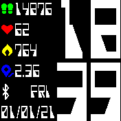

# OmniBip

Crafting New Watchface to Amazfit Bip

   

### Installing watchface
Download [**OmniBip** Watchface](https://github.com/OmniMir/OmniBip/releases/latest)

Extract `1080e7d66f8c1d14414cab0c659cc948.zip` to `\Android\data\com.xiaomi.hm.health\files\watch_skin_local\1080e7d66f8c1d14414cab0c659cc948\` for **Mi Fit** App OR `\Android\data\com.huami.watch.hmwatchmanager\files\watch_skin_local\1080e7d66f8c1d14414cab0c659cc948\` for **Amazfit Zepp** App on your phone.

In **Mi Fit** or **Amazfit Zepp** connect Amazfit Bip and go to `Profile -> Amazfit Bip -> Themes -> Local Watchfaces` and select new sexy black watchface **OmniBip** with big numbers.

Wait and rejoice!

### Create or edit watchface
Extract resources of any downloaded watchface with CLI **Amazfit Bip Tools**

`.\WatchFace.exe path\to\watchface\any_watchface_name.bin`

Use GUI **Watchface Editor** and your favorite graphic software to create design

Generate new and edited resources with main JSON

Use CLI **Amazfit Bip Tools**

`.\WatchFace.exe path\to\OmniBip\OmniBip.json`

If all is OK, you have files for installing

`OmniBip_packed.bin`
`OmniBip_packed.gif`
`OmniBip_packed.png`
`OmniBip_packed.txt`

Rename `OmniBip_packed.bin` to `1080e7d66f8c1d14414cab0c659cc948.bin`

For installation in Local Watchfaces it is necessary to change beginning of `0010` line from `FF FF FF FF FF FF FF FF` to `0F 00 EE 00 00 00 39 60` in Hex Editor ([Thanks](https://amazfitwatchfaces.com/forum/viewtopic.php?t=128))

### Software
[Amazfit Bip Tools](https://bitbucket.org/valeronm/amazfitbiptools/downloads/)

[Bip Watchface Editor](https://forum.gizchina.it/index.php?/topic/1489-bip-wf-editor-by-ilgruppotester/)

[HxD](https://mh-nexus.de/en/hxd/)

[Mi Fit](https://play.google.com/store/apps/details?id=com.xiaomi.hm.health&hl=ru) or [Amazfit Zepp](https://play.google.com/store/apps/details?id=com.huami.watch.hmwatchmanager)